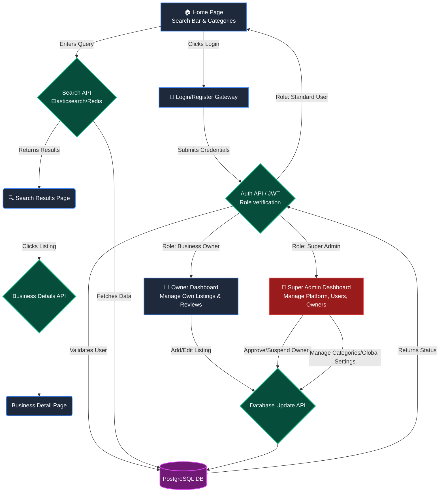

# Comprehensive User, Owner & Admin Flow Diagram

This diagram illustrates the complete workflow, including standard users, business owners, and the platform-wide Super Admin.

> [!NOTE]
> - **Frontend (Blue):** Public facing UI for users and business owners.
> - **Backend/APIs (Green):** The server-side logic and authentication mechanisms.
> - **Database (Purple):** PostgreSQL persistent storage.
> - **Super Admin (Red):** Top-level control over the entire platform, including moderating business owners.
